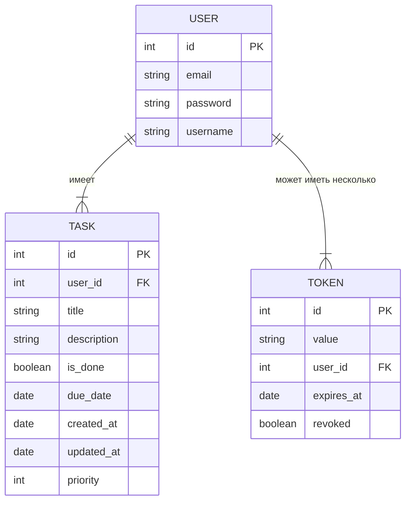

# User Stories: To-Do List (с использованием токенов)

## 1. Регистрация пользователя
**Как** новый пользователь,  
**Я хочу** зарегистрироваться в приложении (указав email и пароль),  
**Чтобы** иметь возможность сохранять свой список задач и возвращаться к нему позже.

## 2. Авторизация (получение токена)
**Как** пользователь,  
**Я хочу** авторизоваться, указав свой email и пароль,  
**Чтобы** получить токен и выполнять действия в приложении.

## 3. Добавление новой задачи
**Как** авторизованный пользователь (с валидным токеном),  
**Я хочу** добавлять задачи в свой личный список,  
**Чтобы** отслеживать свои дела и планировать работу.

## 4. Редактирование задачи
**Как** авторизованный пользователь,  
**Я хочу** иметь возможность редактировать существующие задачи (связанные с моим аккаунтом),  
**Чтобы** обновлять их содержание, дедлайны или приоритет при необходимости.

## 5. Отметка о выполнении задачи
**Как** авторизованный пользователь,  
**Я хочу** отмечать задачу выполненной,  
**Чтобы** видеть прогресс и понимать, какие задачи у меня ещё остаются.

## 6. Удаление задачи
**Как** авторизованный пользователь,  
**Я хочу** удалять задачи, которые мне больше не нужны,  
**Чтобы** поддерживать свой список в актуальном состоянии.

## 7. Фильтрация и сортировка задач (опционально)
**Как** активный пользователь,  
**Я хочу** фильтровать и сортировать задачи по приоритету, статусу (выполнено/невыполнено) или сроку,  
**Чтобы** быстрее находить нужную информацию и удобнее управлять своими задачами.

## 8. Настройки профиля (опционально)
**Как** пользователь,  
**Я хочу** иметь возможность настраивать некоторые параметры приложения (например, тему оформления, количество задач на странице),  
**Чтобы** адаптировать внешний вид и работу приложения под себя.

## 9. Выход из приложения (отзыв токена)
**Как** авторизованный пользователь,  
**Я хочу** иметь возможность «выйти» из приложения, отозвав свой токен,  
**Чтобы** более не иметь доступа к приватным данным.


# Схема сущностей БД


# Команда для поднятия БД
```shell
docker run --name my_postgres -p 5432:5432 -e POSTGRES_USER=admin -e POSTGRES_PASSWORD=admin -e POSTGRES_DB=my_db -d postgres:16
```